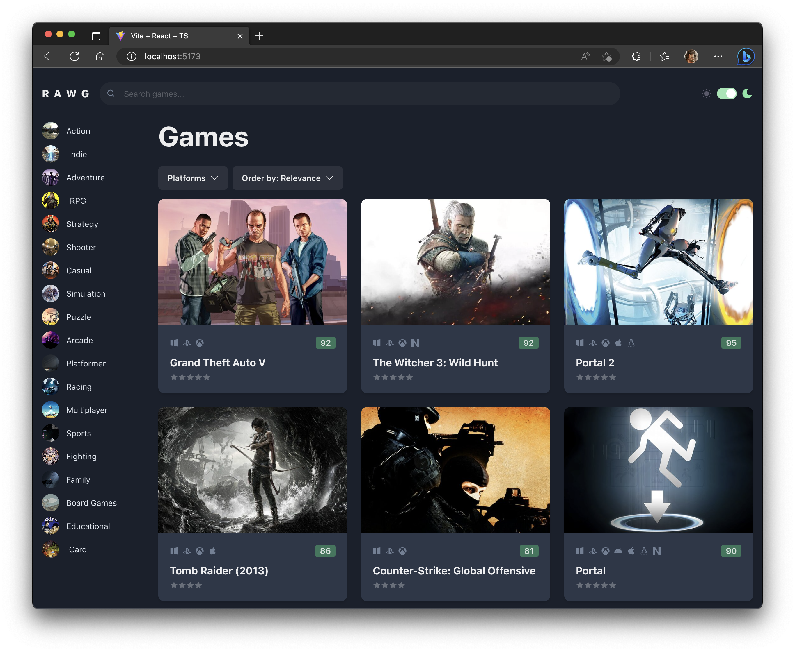

## RAWG Clone

> Demonstrating React 18 features using the RAWG API (https://rawg.io/apidocs)



Featuring:

- Vite (French word for "quick", pronounced "veet") `npm create vite@latest`

- Use Chakra UI in your project

1. Installation

In a Vite React project, install Chakra UI by running either of the following:

`npm i @chakra-ui/react @emotion/react @emotion/styled framer-motion`

After installing Chakra UI, you need to set up the ChakraProvider at the root of
your application. This can be either in your index.jsx, index.tsx or App.jsx
depending on the framework you use. For example:

2. Provider Setup (React/Vite)

After installing Chakra UI, you need to set up the ChakraProvider at the root of
your application. Go to the src directory and inside main.jsx or main.tsx, wrap
ChakraProvider around App:

```jsx
import * as React from 'react';
import { ChakraProvider } from '@chakra-ui/react';
import * as ReactDOM from 'react-dom/client';

const rootElement = document.getElementById('root');
ReactDOM.createRoot(rootElement).render(
  <React.StrictMode>
    <ChakraProvider>
      <App />
    </ChakraProvider>
  </React.StrictMode>
);
```

Version 2 of Chakra UI is only compatible with React 18.

3. Customizing theme (Optional)

If you intend to customise the default theme object to match your design
requirements, you need to extend the theme. Chakra UI provides an extendTheme
function that deep merges the default theme with your customizations.

```ts
import { extendTheme, ThemeConfig } from '@chakra-ui/react';

// Here `ThemeConfig` is an interface that contains the configuration of the
// theme provided by Chakra UI. We can extend this interface to add our own
// configuration. Below, we are adding the `initialColorMode` property.
const config: ThemeConfig = {
  initialColorMode: 'dark',
};

const theme = extendTheme({
  config,
  // custom colors here!
});

export default theme;
```

Dependencies:

```json
  "dependencies": {
    "@chakra-ui/react": "^2.5.5",
    "@emotion/react": "^11.10.6",
    "@emotion/styled": "^11.10.6",
    "axios": "^1.3.4",
    "framer-motion": "^10.12.4",
    "react": "^18.2.0",
    "react-dom": "^18.2.0",
    "react-icons": "^4.8.0"
  },
```

Regards, <br />
Luigi Lupini <br />
<br />
I ❤️ all things (🇮🇹 / 🛵 / ☕️ / 👨‍👩‍👧)<br />

## Getting Started

First, run the development server:

```bash
npm run dev
# or
yarn dev
```
